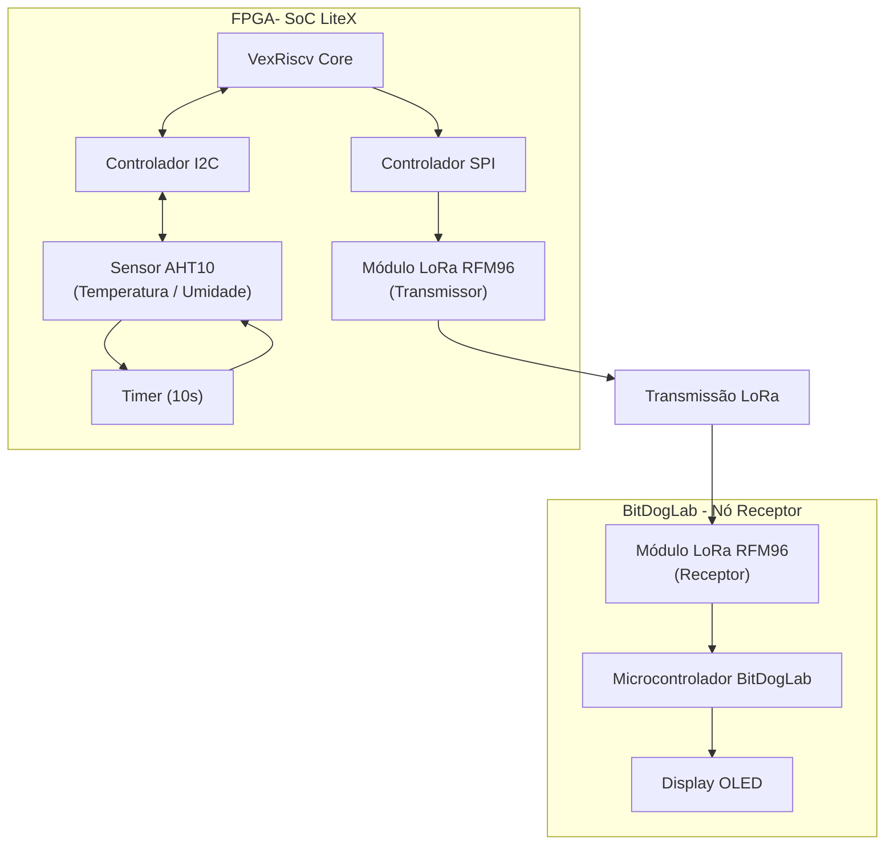

# Transmissão de dados via LoRa — Projeto (FPGA ColorLight i9 ↔ BitDogLab)

## Resumo
SoC customizado (LiteX, VexRiscv) na ColorLight i9 lê AHT10 via I2C e transmite periodicamente (10 s) dados de temperatura/umidade via módulo LoRa RFM96 conectado por SPI. A BitDogLab recebe e exibe no OLED.

---

## Estrutura do repositório

```
hardware/ # Wrapper LiteX e scripts para gerar bitstream
hardware/firmware/ # Firmware C para o VexRiscv (FPGA)
software/software # Firmware do BitDogLab (receptor)
README.md
```

## Hardware

Deve estar dentro da pasta "hardware"

```bash
cd hardware
```

Deve ativar o ambiente do oss-cad-suite

```bash
source [SEU-PATH]/oss-cad-suite/environment
```

Garanta que o ambiente do oss-cad-suite possui tudo que é necessário, inclusive a biblioteca auxiliar usada para gerar o doc 

```bash
pip3 install sphinxcontrib-wavedrom sphinx
```

### Compilar o código em python e subir

#### Código completo

```bash
# build completo (gera bitstream e firmware if enabled)
python3 litex/colorlight_i5.py --board i9 --revision 7.2 --build --load --ecppack-compress

# apenas build
python3 litex/colorlight_i5.py --board i9 --revision 7.2 --build

# apenas load (upload bitstream)
python3 litex/colorlight_i5.py --board i9 --revision 7.2 --load --ecppack-compress

```

```OPCIONAL``` - Após essa etapa, é possível gerar a documentação com o seguinte comando

```bash
sphinx-build -M html build/doc/ build/doc/_docs
```

O arquivo gerado por esse comando está presente na raiz do arquivo hardware - nome: _docs

### Compilar o código em c

```bash
cd firmware

make

cd..
```

### Subir o firmware em python para a FPGA

```bash
sudo [SEU-PATH]/oss-cad-suite/bin/openFPGALoader -b colorlight-i5 build/colorlight_i5/gateware/colorlight_i5.bit
```

### Subir o código em C e iniciar o Terminal Serial FPGA

```bash
litex_term /dev/ttyACM0 --kernel firmware/firmware.bin 

# no litex> prompt:

litex> reboot
```

## BitDogLab

Primeiro, vamos precisar da extensão Raspberry Pi Pico, devemos abrir um projeto dentro da pasta software para realizar as configurações e rodar os comandos.

```bash
code software/software
```

Após a extensão identificar que esse diretório é um projeto raspberry pi pico, podemos seguir com os passos

### Gerar arquivo de build

```bash
cmake -G Ninja -S . -B build

cmake --build build
```

Após isso podemos usar a interface da extensão *Raspberry Pi Pico*

## Diagrama de blocos:

# Diagrama de Blocos – Sistema LoRa FPGA ↔ BitDogLab



## **Descrição do Fluxo**

| Parte | Função |
|------|--------|
FPGA (SoC LiteX) | Coleta dados via I2C + envia via LoRa (SPI)  
Sensor AHT10 | Mede temperatura e umidade  
Módulo LoRa (FPGA) | Transmissor LoRa  
BitDogLab | Recebe e exibe dados  
OLED | Mostra temperatura e umidade em tempo real  

---

## **Resumo do Processo**

1. FPGA inicializa SPI, I2C e timer
2. A cada 10s:
   - lê sensor AHT10 (I2C)
   - envia dados via LoRa (SPI → RFM96)
3. BitDogLab recebe via LoRa
4. MCU decodifica e mostra no OLED

---

# Informações

## Pinos Mapeados

### SPI (LoRa)

| Função  | FPGA pin | PIN |
| ------- | -------: | --- |
| SPI CLK |      G20 | 14  |
| MOSI    |      L18 | 12  |
| MISO    |      M18 | 11  |
| CS_N    |      N17 | 9   |
| RESET   |      L20 | 10  |


### I2C (AHT10)

| Função | FPGA pin | PIN |
| ------ | -------: | --- |
| SCL    |      U17 | 1   |
| SDA    |      U18 | 2   |

## Dados sobre frequência

- ```sys_clk_freq do SoC:``` 60 MHz (padrão no wrapper). Ajustável via --sys-clk-freq.

- LoRa:
    - frequência central: 915 MHz (verifique legislação local).
    - Bandwidth: 125 kHz

- SPI para LoRa: 1–8 MHz.
- I2C: 100 kHz (bitbang I2C master)
